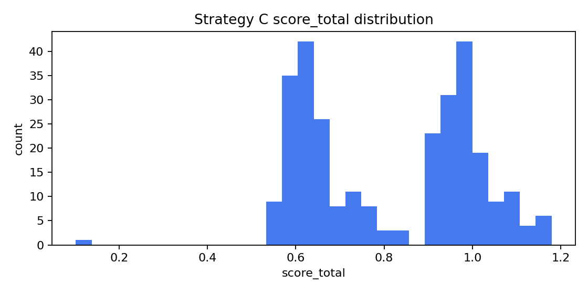
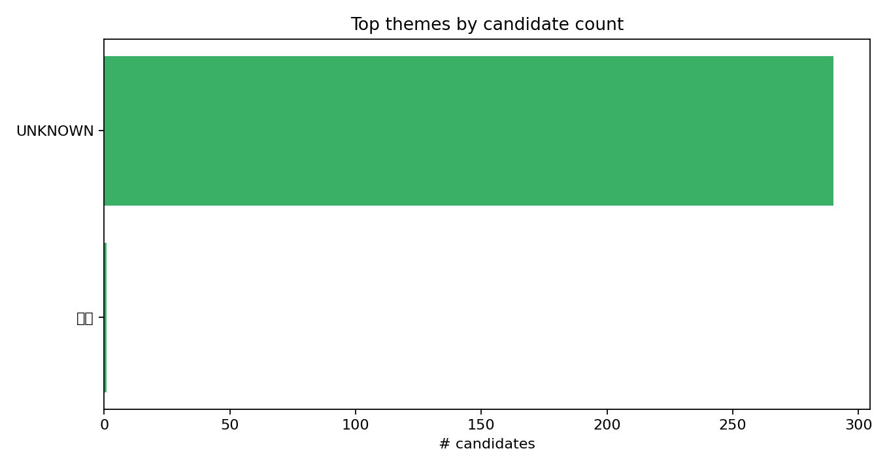

# tw-daytrade-picker
 
 台股（TWSE/TPEX）盤後量化資料管線。
 
 這個專案提供：
 - 每日盤後資料抓取（TWSE/TPEX）
 - 可插拔式策略模組
 - Strategy C：**題材族群動能＋跟漲股**（Thematic Sector Momentum & Followers）
 - 一鍵產出 **Markdown + 圖表報告**（GitHub 友善，可直接展示）
 
 ## 亮點
 
 - **Strategy C 候選股清單**輸出 CSV/Excel（`strategyC_candidates_YYYY-MM-DD.*`）
 - **自動模式**：自動選擇「最新有資料的交易日」（適合用 Windows 工作排程器）
 - **報告產生器**：候選股表格 + 分數分佈 + 題材排行榜 + 市場散佈圖
 
 範例報告輸出（本機產生）：
 - `reports/report_2025-12-26.md`
 - `reports/score_dist_2025-12-26.png`
 - `reports/themes_top_2025-12-26.png`
 - `reports/turnover_scatter_2025-12-26.png`
 



 
 ## 快速開始
 
 1. 建立 venv 並安裝依賴
 2. 安裝本專案（editable）
 3. 執行盤後管線
 
```bash
python -m pip install -r requirements.txt
python -m pip install -e .
```
 
 ## 指令
 
 ### 1) 抓取盤後資料（指定日期）
 
```bash
python -m daytrade_picker run --date 2025-12-26 --config config.yaml
```
 
 輸出：
 - `DayTradePicker_Results/market_YYYY-MM-DD.csv`
 - `DayTradePicker_Results/YYYY-MM-DD.xlsx`
 - `data/daytrade_picker.sqlite`
 
 ### 2) 自動執行（最新有資料的交易日）
 
 適合在開盤後（或任何時間）執行，不用手動挑日期。
 
```bash
python -m daytrade_picker run-auto --config config.yaml
```
 
 ### 3) Strategy C（族群=題材 themes）
 
 Strategy C 會讀取既有的 `market_*.csv` 歷史資料，並使用 `data/themes_mapping.csv` 做題材分群。
 
```bash
python -m daytrade_picker run-strategy-c --date 2025-12-26 --config config_strategyC.yml \
  --market-dir DayTradePicker_Results --themes-mapping data/themes_mapping.csv --history-days 60 \
  --out-dir DayTradePicker_Results
```
 
 輸出：
 - `DayTradePicker_Results/strategyC_candidates_YYYY-MM-DD.csv`
 - `DayTradePicker_Results/strategyC_candidates_YYYY-MM-DD.xlsx`
 
 ### 4) 產出報告（Markdown + PNG）
 
```bash
python -m daytrade_picker report --date 2025-12-26 \
  --market-dir DayTradePicker_Results --results-dir DayTradePicker_Results --out-dir reports
```
 
 輸出：
 - `reports/report_YYYY-MM-DD.md`
 - `reports/*.png`
 
 ## 注意事項
 
 - **題材對應表**：如果你看到很多 `UNKNOWN`，代表 `data/themes_mapping.csv` 覆蓋不夠，需要補齊。
 - **歷史資料需求**：MA/量比/停損建議等指標需要足夠的 `market_*.csv` 歷史天數。
 
 ## 專案結構
 
```text
tw-daytrade-picker/
  src/daytrade_picker/
    sources/              # TWSE/TPEX fetchers
    strategies/           # Strategy A (baseline)
    strategy_c/           # Strategy C (themes momentum & followers)
    reporting.py          # Markdown + PNG report generator
    cli.py                # CLI entry
  DayTradePicker_Results/ # Generated outputs (CSV/Excel)
  reports/                # Generated reports (Markdown/PNG)
  data/                   # SQLite + themes_mapping.csv
```
 
Outputs will be written to `DayTradePicker_Results/`.
