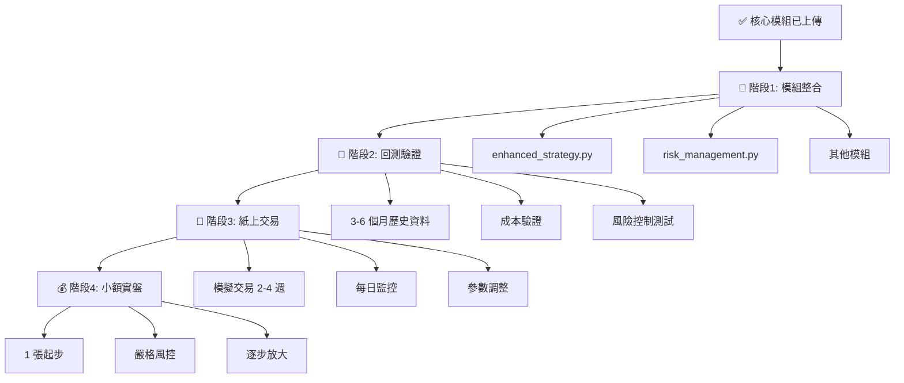

# 🚀 下階段執行指南

> **版本:** 2.0  
> **適用對象:** 完成核心模組上傳後的下一步行動  
> **預計時間:** 2-4 週完成整合與驗證

---

## 📌 當前狀態

### ✅ 已完成
- 4 個核心模組已上傳到 GitHub
- 生產環境配置檔案已建立
- 測試框架已部署
- 快速驗證腳本已建立

### ⏳ 待執行
- 現有模組整合（6 個檔案）
- 回測驗證
- 紙上交易測試

---

## 🎯 執行路線圖



---

## 📝 階段 1：模組整合（1-2 週）

### 優先順序

| 優先級 | 模組 | 改進重點 | 預估時間 |
|--------|------|---------|---------|
| 🔴 P0 | **enhanced_strategy.py** | 錯誤處理、NaN 處理 | 1-2 天 |
| 🔴 P0 | **risk_management.py** | ATR 動態停損、成本整合 | 2-3 天 |
| 🔴 P0 | **backtesting.py** | 前視偏差修正、成本計算 | 2-3 天 |
| 🟡 P1 | **market_environment.py** | 震盪市識別、錯誤處理 | 1-2 天 |
| 🟡 P1 | **multi_timeframe.py** | 資料驗證、錯誤處理 | 1-2 天 |
| 🟢 P2 | **main_strategy.py** | 日誌系統、錯誤處理 | 1 天 |

### 快速開始

#### 步驟 1: 克隆更新後的專案

```bash
cd ~/projects
git clone https://github.com/tom602229/tw-daytrade-picker.git
cd tw-daytrade-picker

# 或更新現有專案
git pull origin main
```

#### 步驟 2: 驗證核心模組

```bash
# 執行快速測試
python scripts/quick_test.py
```

**預期輸出：**
```
🧪 TW DayTrade Picker - 核心模組快速測試
================================================================================
📦 1. 測試錯誤處理模組
   ✓ safe_execute 裝飾器: ✅ 通過
   ✓ safe_calculate 函數: ✅ 通過
   ✅ 錯誤處理模組測試通過

📦 2. 測試資料驗證模組
   ✓ OHLCV 驗證: ✅ 通過
   ✓ NaN 檢測: ✅ 通過
   ✓ 資料清理: ✅ 通過
   ✅ 資料驗證模組測試通過

📦 3. 測試交易成本計算模組
   ✓ 總成本: 370.00 元
   ✓ 成本比例: 0.365%
   ✓ 成本合理性: ✅ 通過
   ✅ 交易成本模組測試通過

📦 4. 測試資金曲線保護模組
   ✓ 獲利狀態: ACTIVE ✅
   ✓ 回撤 5% 狀態: REDUCED ✅
   ✓ 回撤 10% 狀態: SUSPENDED ✅
   ✅ 資金保護模組測試通過

🎉 恭喜！所有核心模組測試通過！
```

#### 步驟 3: 開始整合第一個模組

**選擇 enhanced_strategy.py（最重要）**

1. **備份原始檔案**
```bash
cp src/daytrade_picker/strategy_c/enhanced_strategy.py \
   src/daytrade_picker/strategy_c/enhanced_strategy.py.backup
```

2. **在檔案開頭加入核心模組匯入**
```python
# 在 enhanced_strategy.py 開頭加入
from ..core.error_handler import ErrorHandler, safe_calculate
from ..core.data_validator import DataValidator
```

3. **在 __init__ 方法加入初始化**
```python
class EnhancedStrategy:
    def __init__(self, config):
        # 原有程式碼...
        
        # 🆕 加入核心模組
        self.error_handler = ErrorHandler(logger=self.logger)
        self.data_validator = DataValidator(logger=self.logger)
```

4. **為關鍵方法加入錯誤處理**
```python
# 原本：
def calculate_rsi(self, data, period=14):
    delta = data['close'].diff()
    gain = (delta.where(delta > 0, 0)).rolling(window=period).mean()
    loss = (-delta.where(delta < 0, 0)).rolling(window=period).mean()
    rs = gain / loss
    rsi = 100 - (100 / (1 + rs))
    return rsi

# 改為：
@safe_calculate(default_return=pd.Series(), error_msg="RSI 計算失敗")
def calculate_rsi(self, data, period=14):
    # 🆕 驗證資料
    if not self.data_validator.validate_dataframe(data, required_columns=['close']):
        return pd.Series()
    
    # 🆕 清理 NaN
    data = self.data_validator.clean_data(data)
    
    # 原有計算邏輯
    delta = data['close'].diff()
    gain = (delta.where(delta > 0, 0)).rolling(window=period).mean()
    loss = (-delta.where(delta < 0, 0)).rolling(window=period).mean()
    
    # 🆕 安全除法（避免除以零）
    rs = self.error_handler.safe_divide(gain, loss, default=0.0)
    rsi = 100 - (100 / (1 + rs))
    
    return rsi
```

5. **測試修改後的模組**
```bash
# 執行單元測試
python -m pytest tests/test_core_modules.py -v

# 或簡單測試
python -c "
from src.daytrade_picker.strategy_c.enhanced_strategy import EnhancedStrategy
config = {'rsi_period': 14}
strategy = EnhancedStrategy(config)
print('✅ enhanced_strategy.py 載入成功')
"
```

---

## 🧪 階段 2：回測驗證（1 週）

### 準備回測資料

```python
# scripts/prepare_backtest_data.py
import yfinance as yf
import pandas as pd
from datetime import datetime, timedelta

# 下載台股資料（以台積電為例）
end_date = datetime.now()
start_date = end_date - timedelta(days=180)  # 6 個月

# 台積電 2330.TW
data = yf.download('2330.TW', start=start_date, end=end_date, interval='5m')
data.to_csv('data/backtest/2330_6months.csv')

print(f"✅ 已下載 {len(data)} 筆 5 分鐘資料")
```

### 執行回測

```python
# scripts/run_backtest.py
import sys
sys.path.insert(0, 'src')

from daytrade_picker import BacktestEngine
from daytrade_picker.utils import load_config
import pandas as pd

# 載入配置
config = load_config('config/config_enhanced_v2.yml')

# 載入資料
data = pd.read_csv('data/backtest/2330_6months.csv', index_col=0, parse_dates=True)

# 建立回測引擎
engine = BacktestEngine(config)

# 執行回測
print("開始回測...")
results = engine.run(data)

# 顯示結果
print("\n" + "=" * 80)
print("📊 回測結果")
print("=" * 80)
print(f"總交易次數: {results['total_trades']}")
print(f"勝率: {results['win_rate']:.2%}")
print(f"總報酬: {results['total_return']:.2%}")
print(f"最大回撤: {results['max_drawdown']:.2%}")
print(f"夏普比率: {results['sharpe_ratio']:.2f}")
print(f"交易成本總計: {results['total_costs']:.2f} 元")

# 🔍 關鍵檢查
print("\n" + "=" * 80)
print("🔍 關鍵檢查項目")
print("=" * 80)

checks = {
    '交易成本合理 (0.3-0.5%)': 0.003 <= results['avg_cost_pct'] <= 0.005,
    '最大回撤在限制內 (<10%)': results['max_drawdown'] < 0.10,
    '無 NaN 錯誤': results['nan_errors'] == 0,
    '停損機制運作': results['stop_loss_triggered'] > 0,
    '資金保護觸發': results['protection_triggered'] >= 0,
}

for check_name, passed in checks.items():
    status = "✅ 通過" if passed else "❌ 失敗"
    print(f"   {check_name}: {status}")

all_checks_pass = all(checks.values())
if all_checks_pass:
    print("\n🎉 回測驗證通過！可以進入紙上交易階段")
else:
    print("\n⚠️  部分檢查未通過，請檢查並修正")
```

### 回測檢查清單

- [ ] 交易成本計算正確（約 0.35-0.40%）
- [ ] ATR 動態停損有運作
- [ ] 資金保護機制有觸發（模擬虧損情境）
- [ ] 無 NaN 相關錯誤
- [ ] 前視偏差已消除（檢查交易時間戳記）
- [ ] 最大回撤在設定範圍內（<10%）

---

## 📄 階段 3：紙上交易（2-4 週）

### 配置紙上交易模式

編輯 `config/config_enhanced_v2.yml`：

```yaml
# 啟用紙上交易
testing:
  paper_trading: true
  test_capital: 1000000
  test_log_level: "DEBUG"

# 確保實盤關閉
live_trading:
  enabled: false
```

### 每日執行腳本

```python
# scripts/daily_paper_trading.py
import sys
sys.path.insert(0, 'src')

from daytrade_picker import TradingEngine
from daytrade_picker.utils import load_config
from datetime import datetime

config = load_config('config/config_enhanced_v2.yml')
engine = TradingEngine(config, mode='paper')

print(f"📄 紙上交易 - {datetime.now().strftime('%Y-%m-%d')}")
print("=" * 80)

# 運行策略
signals = engine.run()

# 記錄結果
for signal in signals:
    print(f"信號: {signal['action']} {signal['symbol']} @ {signal['price']}")
    print(f"  原因: {signal['reason']}")
    print(f"  部位: {signal['position_size']} 張")
    print(f"  停損: {signal['stop_loss']}")

# 顯示帳戶狀態
account = engine.get_account_status()
print(f"\n帳戶狀態:")
print(f"  資金: {account['equity']:,.0f} 元")
print(f"  今日損益: {account['daily_pnl']:+,.0f} 元 ({account['daily_pnl_pct']:+.2%})")
print(f"  總損益: {account['total_pnl']:+,.0f} 元 ({account['total_pnl_pct']:+.2%})")
print(f"  最大回撤: {account['max_drawdown']:.2%}")

# 風險狀態
print(f"\n風險狀態:")
print(f"  交易狀態: {account['trading_status']}")
print(f"  部位倍數: {account['position_multiplier']:.2f}")
print(f"  連續虧損: {account['consecutive_losses']} 次")
```

### 每日檢查清單

```bash
# 建立 scripts/daily_checklist.sh
#!/bin/bash

echo "📋 每日紙上交易檢查清單"
echo "========================================"

# 1. 執行策略
python scripts/daily_paper_trading.py

# 2. 檢查日誌
echo "\n📝 檢查錯誤日誌..."
if [ -f "logs/errors/$(date +%Y-%m-%d).log" ]; then
    error_count=$(wc -l < "logs/errors/$(date +%Y-%m-%d).log")
    echo "   錯誤數量: $error_count"
    if [ $error_count -gt 0 ]; then
        echo "   ⚠️  有錯誤，請檢查日誌"
        tail -5 "logs/errors/$(date +%Y-%m-%d).log"
    fi
else
    echo "   ✅ 無錯誤日誌"
fi

# 3. 生成每日報告
python scripts/generate_daily_report.py

echo "\n✅ 每日檢查完成"
```

---

## 💰 階段 4：小額實盤（1-2 個月）

### 實盤前最終檢查

```bash
# scripts/pre_live_checklist.sh

echo "🔍 實盤交易前最終檢查"
echo "========================================"

CHECKS=(
    "回測 6 個月資料表現穩定"
    "紙上交易 2 週無異常"
    "所有測試通過"
    "風險參數確認完成"
    "監控系統已建立"
    "緊急停止機制已測試"
)

for check in "${CHECKS[@]}"; do
    read -p "✓ $check (y/n): " answer
    if [ "$answer" != "y" ]; then
        echo "❌ 未完成：$check"
        echo "請完成後再進行實盤交易"
        exit 1
    fi
done

echo "\n✅ 所有檢查通過，可以開始小額實盤"
```

### 實盤配置（保守參數）

```yaml
# config/config_live_conservative.yml

capital:
  initial_capital: 100000  # 10 萬起步

position_management:
  base_position_size: 1    # 只交易 1 張
  max_position_size: 2     # 最多 2 張

risk_management:
  max_daily_loss_pct: 1.0  # 單日虧損降至 1%
  max_drawdown_pct: 5.0    # 最大回撤降至 5%
  consecutive_loss_limit: 2

live_trading:
  enabled: true
  require_confirmation: true  # 每筆都需確認
  max_order_value: 50000      # 單筆最大 5 萬
```

---

## 📊 監控與告警

### 建立監控儀表板

```python
# scripts/monitor_dashboard.py
import streamlit as st
import pandas as pd
from daytrade_picker.utils import load_trading_log

st.title("🎯 TW DayTrade Picker - 即時監控")

# 讀取交易日誌
trades = load_trading_log()

# 顯示關鍵指標
col1, col2, col3, col4 = st.columns(4)

with col1:
    st.metric("今日損益", f"{trades['daily_pnl']:.0f}", 
              f"{trades['daily_pnl_pct']:.2%}")

with col2:
    st.metric("總損益", f"{trades['total_pnl']:.0f}",
              f"{trades['total_pnl_pct']:.2%}")

with col3:
    st.metric("勝率", f"{trades['win_rate']:.1%}")

with col4:
    st.metric("最大回撤", f"{trades['max_drawdown']:.2%}")

# 資金曲線
st.line_chart(trades['equity_curve'])

# 最近交易
st.subheader("最近交易")
st.dataframe(trades['recent_trades'].tail(10))

# 風險警報
if trades['max_drawdown'] > 0.05:
    st.warning(f"⚠️  回撤超過 5%：{trades['max_drawdown']:.2%}")

if trades['consecutive_losses'] >= 2:
    st.error(f"🚨 連續虧損 {trades['consecutive_losses']} 次")
```

執行：
```bash
streamlit run scripts/monitor_dashboard.py
```

---

## 🎯 成功標準

### 階段 1：模組整合
- [ ] 所有模組整合完成
- [ ] 測試通過無錯誤
- [ ] 程式碼審查完成

### 階段 2：回測驗證
- [ ] 回測 6 個月資料
- [ ] 交易成本計算正確
- [ ] 風險控制機制有效
- [ ] 最大回撤 < 10%
- [ ] 夏普比率 > 1.0

### 階段 3：紙上交易
- [ ] 執行 2-4 週
- [ ] 每日無異常錯誤
- [ ] 風險控制正常運作
- [ ] 虛擬績效穩定

### 階段 4：小額實盤
- [ ] 初期資金 10-30 萬
- [ ] 單張起步
- [ ] 嚴格風控（1% 單日虧損）
- [ ] 連續盈利 1 個月後考慮放大

---

## ⚠️ 風險提醒

1. **絕對不要跳過回測和紙上交易階段**
2. **實盤必須從小額開始**
3. **嚴格遵守風險控制參數**
4. **連續虧損立即暫停檢討**
5. **定期檢視和優化策略**

---

## 📞 問題排查

### 常見問題

**Q: 測試時出現 ModuleNotFoundError**
```bash
# 解決方案：確認 Python 路徑
export PYTHONPATH="${PYTHONPATH}:/path/to/tw-daytrade-picker/src"
```

**Q: 回測結果異常（報酬率過高/過低）**
- 檢查交易成本是否計算
- 檢查是否有前視偏差
- 檢查資料品質

**Q: 紙上交易無信號**
- 檢查市場狀態判斷
- 調整信號強度閾值
- 檢查資料來源

---

## 📚 參考文件

- **改進實作指南:** `docs/改進實作指南.md`
- **系統升級報告:** `docs/系統升級總結報告.md`
- **整合完成報告:** `docs/整合完成報告.md`
- **配置檔案:** `config/config_enhanced_v2.yml`

---

**祝你整合順利，交易獲利！** 🚀💰
